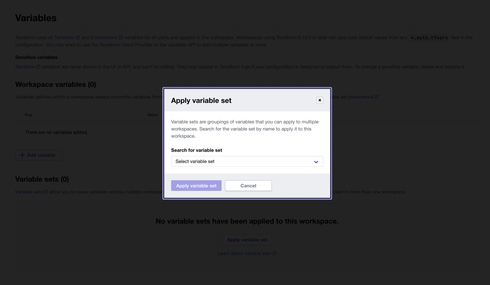

# api-lambda-aurora-go

## TL;DR;

[`go`]: https://go.dev/
[`gin`]: https://github.com/gin-gonic/gin
[`terraform`]: https://www.terraform.io/
[`waypoint`]: https://www.waypointproject.io/
[`gorm`]: https://gorm.io/
[`docker`]: https://www.docker.com/

- HTTP API written in [`go`]
    - Framework: [`gin`]
    - ORM: [`gorm`]
    - API Docs: `redocly`
- Infrastructure via [`terraform`]
    - 1 x Aurora Serverless V2 (Postgres)
        - This currently reuses an existing VPC and Security Group.
- Build, deploy, release via [`waypoint`]
    - Builds via [`docker`]
    - Deploys to AWS Lambda
    - Releases to AWS Lambda Function URL
    - Environment variables sourced from Terraform Cloud


## Overview

### Development

Local development uses `docker compose`.

```bash
docker compose build && docker compose up
```

### Production

> **Warning**: There is an expected one-time set up of various
> Terraform Cloud things, such as an organization, workspace,
> and variables (ex. AWS credentials and VPC IDs).
>
> **Variable sets** are a newer and powerful option to use here. 
> Currently the API documentation is a bit rough to reference, and 
> there isn't a CLI option, so manual click-ops should suffice.
>
> 

> **Note**: See [`Makefile`](./Makefile) for commands to deploy.

## Project Structure

Application code

```
.
├── controllers → aka handler functions
├── db          → models; db connection
├── main.go     → main application
├── middleware  → middleware — docs, db injection, auth, etc.
└── routes      → mapping of routes to controllers

```

## Todos + Improvements

- [ ] Document any manual steps;
    - ex. Adding default VPC and security group ID in Terraform Cloud
- [ ] Provide all essential [`Makefile`](./Makefile) targets
- [ ] Testing
    - Unit testing
    - Integration testing in GitHub actions
    - Consider [localstack](https://localstack.cloud/)
- [ ] Make persistence layer configurable
    - Postgres
    - DynamoDB
    - Redis
    - etc.
- [ ] Introduce background tasks
    - AWS SQS
- [ ] Turn this all into a generator CLI.
- [ ] Consider `nixos` for reproducible environments (ex. provide `docker`, `terraform`, `waypoint`, etc.)


### 12-factor?

> **Note**: See https://12factor.net/

1. [ ] Codebase
1. [ ] Dependencies
1. [ ] Config
1. [ ] Backing services
1. [ ] Build, release, run
1. [ ] Processes
1. [ ] Port binding
1. [ ] Concurrency
1. [ ] Disposability
1. [ ] Dev/prod parity
1. [ ] Logs
1. [ ] Admin processes
